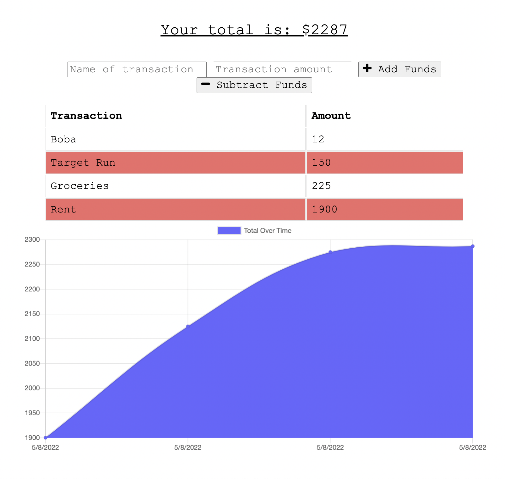

## Budget Tracker Progressive Web Application (PWA)

# Table of Contents

- [Description](#description)
- [Installation](#installation)
- [Technologies](#technologies)
- [Repository](#repository)
- [Questions](#questions)
- [License](#license)

  # Description

  
  
   

  This app is an existing budget tracker application that was updated to allow for offline access and functionality. The user will be able to add expenses and deposits to their budget with or without a connection.

  # Installation

  - Clone this repository and run `npm i` in your terminal to start the application.

  # Technologies

  - HTML
  - CSS
  - JavaScript
  - Node.js
  - Express.js
  - MongoDB
  - Progressive Web Application (PWA)

  # Repository

  - <a href="https://github.com/saraoros">Github Repository</a>

  # Questions

  - saragochez13@gmail.com

  # License

  Copyright © 2022 Sara Oros

      Permission is hereby granted, free of charge, to any person obtaining a copy of this software and associated documentation files (the "Software"), to deal in the Software without restriction, including without limitation the rights to use, copy, modify, merge, publish, distribute, sublicense, and/or sell copies of the Software, and to permit persons to whom the Software is furnished to do so, subject to the following conditions:

      The above copyright notice and this permission notice shall be included in all copies or substantial portions of the Software.

      THE SOFTWARE IS PROVIDED "AS IS", WITHOUT WARRANTY OF ANY KIND, EXPRESS OR IMPLIED, INCLUDING BUT NOT LIMITED TO THE WARRANTIES OF MERCHANTABILITY, FITNESS FOR A PARTICULAR PURPOSE AND NONINFRINGEMENT. IN NO EVENT SHALL THE AUTHORS OR COPYRIGHT HOLDERS BE LIABLE FOR ANY CLAIM, DAMAGES OR OTHER LIABILITY, WHETHER IN AN ACTION OF CONTRACT, TORT OR OTHERWISE, ARISING FROM, OUT OF OR IN CONNECTION WITH THE SOFTWARE OR THE USE OR OTHER DEALINGS IN THE SOFTWARE.
